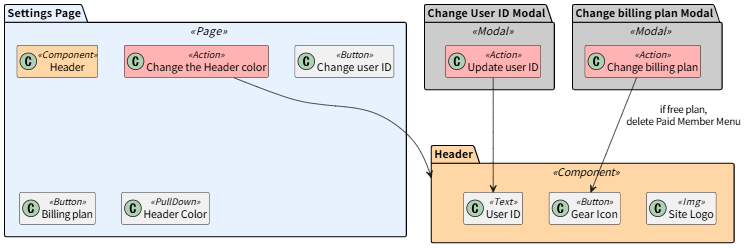

# AIM

## 概要
- AIM(エイム, Action Impact Model)は、クラス図をベースとした、ユーザーのアクションによる影響範囲を可視化してテストの"狙い"を定めるためのモデリング記法である
- ドキュメンテーション・影響分析・AIを活用したテスト設計/実装等を目的として設計されている



---

## AIMの描き方
- 各UIパッケージは、「ページ」「モーダル」「コンポーネント」などを表し、以下のクラスを内包する
    - UI要素: そのパッケージ内に含まれるインタラクティブまたは視覚的な要素(e.g. ボタン・テキストボックス)
    - ユーザーのアクション: ユーザーがその画面上で行う操作
- あるユーザーのアクションがあるUI要素に影響を及ぼすとき、その関係を矢印(`-->`)で表す
    - 影響を及ぼす際の条件や影響の詳細は、ラベルで表現する
    - 影響が自明な場合(例: 「ユーザーIDを変更する」を実行すると「ユーザーID」の表示内容が変更される等)は、ラベルを省略してもよい
- 各パッケージ・各クラスは、UCODと相互変換できる関係にある
    - 矢印は変換できない
- [デザインガイド](./docs/aim-design-guide.ja.md)

---

## AIMの活用用途
- 影響範囲の整理:
    - あるユーザーのアクションがどのUI要素に影響を与えるかを整理できる
    - 特定アクションが影響を与えるUI要素が多すぎないか・特定UI要素が影響を受けるアクションが多すぎないかなど、システムの改善点を識別することにも役立つ
- 生成AIによるテストケースの設計:
    - 生成AIにAIMを読み込ませ、AIMに記載されている影響範囲を網羅させることで、テストスイートを設計できる
    - [プロンプト例](./prompts/generate-testcases-by-aim.md)
- 生成AIによる自動テストの自動実装:
    - 生成AIに、AIM・プロダクトコードの差分・AIMの姉妹モデルである[UCOD](https://github.com/hansuoi/ucod)とを読み込ませることで、プロダクトのインクリメント部分をテスト対象とした、POM(Page Object Model)による自動テストを自動生成できる
    - [プロンプト例](./prompts/generate-pom-for-increment.md)

---

## このリポジトリのディレクトリ構成
```
.
├─ README.md                 # このファイル
├─ docs/
│  ├─ aim-design-guide.en.md
│  └─ aim-design-guide.ja.md
├─ prompts/
│  ├─ generate-impact-tests.md
│  └─ analyze-impact.md
└─ samples/
   ├─ aim-sample.puml
   └─ ucod-sample-paired-with-aim.puml
```
